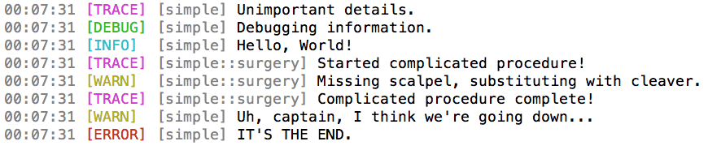

# badlog

A garishly colored and extremely simple logger - the best kind.



## Installation

```toml
[dependencies]
badlog = "0.2.5"
log = "0.3"
```

## Documentation

You have two initializers:

```rust
fn init_from_env<T: AsRef<str>>(envar: T);
fn init<T: AsRef<str>>(level: Option<T>);
```

And from there it's just [the standard log crate macros](https://doc.rust-lang.org/log/log/index.html)!

## Example

```rust
#[macro_use] extern crate log;
extern crate badlog;

fn main() {
    badlog::init_from_env("LOG_LEVEL");

    trace!("Unimportant details.");
    debug!("Debugging information.");
    info!("Hello, World!");
    warn!("Uh, captain, I think we're going down...");
    error!("IT'S THE END.");
}
```

## License

MIT.
